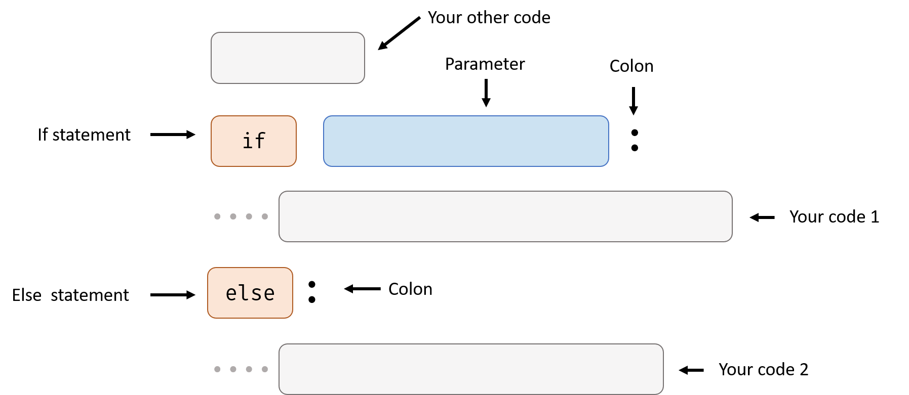
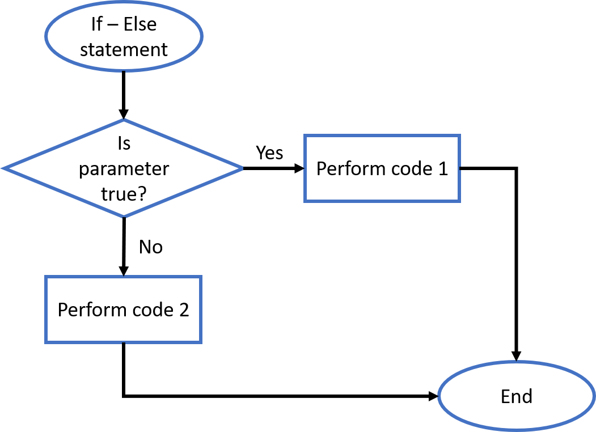
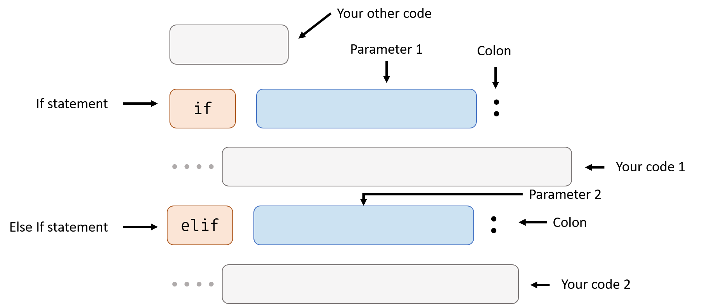
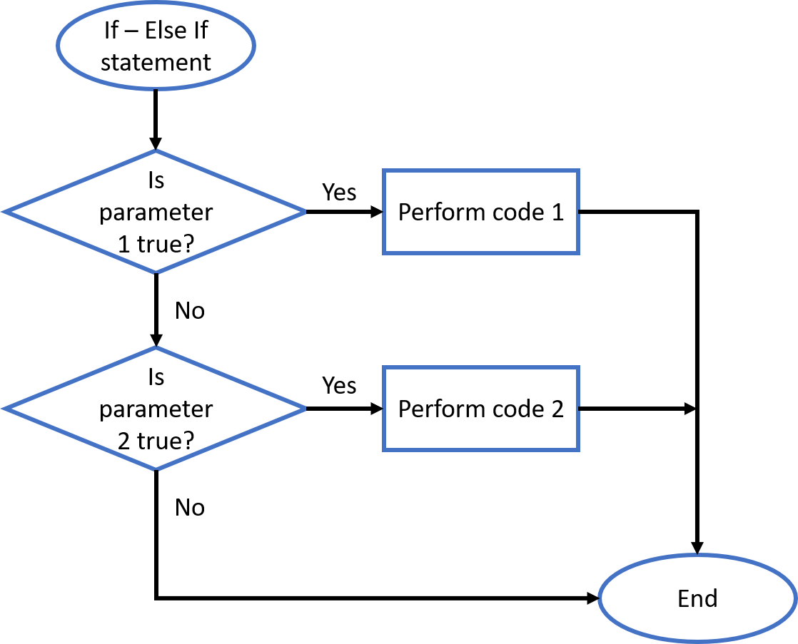
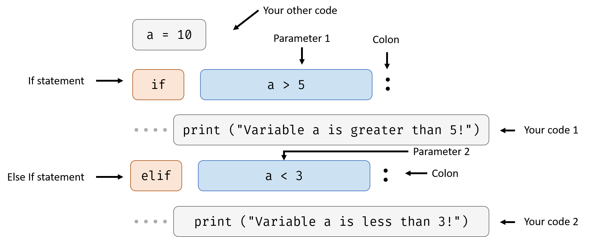

# Advanced Control Flow

## More About If Statement

### If - Else Statement

If - Else statement is not an independent statement, you need to write it after an if statement.

When the parameter in the if statement is not True, python will execute the code under the else statement.

This is an example from *Control Flow* handout:

<iframe src="https://test.pegasis.site/python/editor.html?fileName=1559005466" width="100%" height="127px" frameborder="0" marginwidth="0" marginheight="0" allowfullscreen></iframe>

Now I want to let my program output a sentence if `a` is not greater than 5 as well. I can do this:

<iframe src="https://test.pegasis.site/python/editor.html?fileName=1559123307" width="100%" height="158px" frameborder="0" marginwidth="0" marginheight="0" allowfullscreen></iframe>

Try changing `a = 10` to `a = 2`, see what happens.

There can be only one else statement follow one is statement.

### If - Else If Statement

Else if statement is not an independent statement, you need to write it after an if statement.

This is an example from *Control Flow* handout:

<iframe src="https://test.pegasis.site/python/editor.html?fileName=1559005466" width="100%" height="127px" frameborder="0" marginwidth="0" marginheight="0" allowfullscreen></iframe>

Now I want to know if Variable `a` is less than 3 if it's not greater than 5.

I can write like this:

<iframe src="https://test.pegasis.site/python/editor.html?fileName=1559121981" width="100%" height="158px" frameborder="0" marginwidth="0" marginheight="0" allowfullscreen></iframe>

Try to change `a = 10` to `a = 1`, what will happen?

Maybe you are wondering what's the difference between the example above this and the following example:

<iframe src="https://test.pegasis.site/python/editor.html?fileName=1559122171" width="100%" height="158px" frameborder="0" marginwidth="0" marginheight="0" allowfullscreen></iframe>

The difference is in the else if statement, if the first if parameter is true, python will not check the second parameter or run the second code at all. Here's an example:

<iframe src="https://test.pegasis.site/python/editor.html?fileName=1559122373" width="100%" height="158px" frameborder="0" marginwidth="0" marginheight="0" allowfullscreen></iframe>

Try changing the `elif` to `if` or the number at the first line, see what happens.

You can use more than one else if statement under one if statement, For example:

<iframe src="https://test.pegasis.site/python/editor.html?fileName=1559122608" width="100%" height="194px" frameborder="0" marginwidth="0" marginheight="0" allowfullscreen></iframe>

## More About For Statement