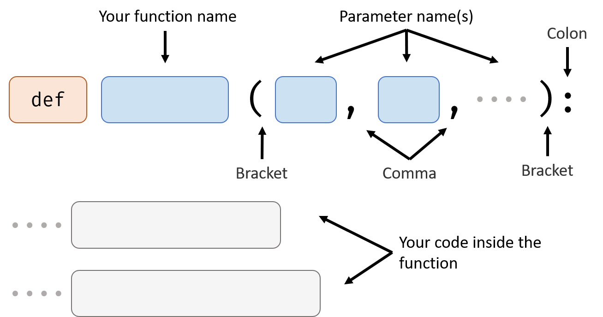

# Advanced Function

You already know how to use a function in the *Basic Function* handout, now lets work on how to make our own function.

## How to Define a Function

### Function Name

The naming rules for function is same as the naming rules for variable:

### Parameter Names

Those are some variable names, when function is called, the value of those variable will become the data that inputs to the function. You can use those variables in your code inside the function.

### Your Code Inside the Function

Those are the code that will execute when you use the function.

## Example - No Return Value

↑ Here we defined a function that will add two numbers together and print the result.

↓And here is how to use it:

<iframe src="https://test.pegasis.site/python/editor.html?fileName=1560706963" width="100%" height="166px" frameborder="0" marginwidth="0" marginheight="0" allowfullscreen></iframe>

When you define the `add` function (the first three lines), the code inside doesn't actually run. The code only runs when you call it(the last line).

When you call it, the parameters you give the function (5 and 20) will be automatically assigned to `a` and `b` (parameter names).

The advantage of function is once you defined it, you can use it as many times you want and give the function different parameters every time.

For example:

<iframe src="https://test.pegasis.site/python/editor.html?fileName=1560707334" width="100%" height="219px" frameborder="0" marginwidth="0" marginheight="0" allowfullscreen></iframe>

### How to Describe It

- Usage: add two number and print the result

- Signature: `add(a, b)`

- Parameters:

  | Name | Value Type | Meaning                       |
  | ---- | ---------- | ----------------------------- |
  | a    | Number     | the first number to be added  |
  | b    | Number     | the second number to be added |

- Return value: None

## Example - Has One Return Value

Let's do some change to the `add` function. Instead of printing result out, we want it to return the result so we can use it in calculation.

Just change the last line:

`return sum` means use the value of  `sum` as the return value of the function. In other word, the return value of the function is sum.

Here's an example of how to use the new `add` function:

<iframe src="https://test.pegasis.site/python/editor.html?fileName=1560708412" width="100%" height="219px" frameborder="0" marginwidth="0" marginheight="0" allowfullscreen></iframe>

### How to Describe It

- Usage: add two number and return the result

- Signature: `add(a, b)`

- Parameters:

  | Name | Value Type | Meaning                       |
  | ---- | ---------- | ----------------------------- |
  | a    | Number     | the first number to be added  |
  | b    | Number     | the second number to be added |

- Return value: Number type, the sum of two number

# Examples

