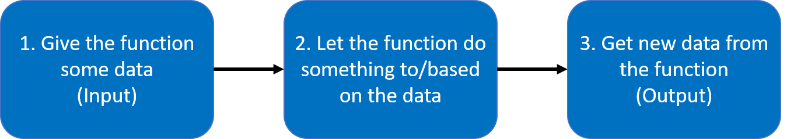
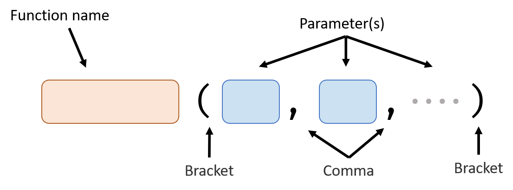

# Basic Function

A function performs a per-defined task when you use it (also known as "when you call it").

Now, we can only use functions that are pre-defined by python. In the *Advanced Function* handout, we will learn how to define a function by ourselves.

Here's the full process of using a function:

## Basic Structure

### Parameter(s)

This is the place where you give data to the function. 

You can don't give a function any parameter, one parameter or multiple parameters. Parameters are separated by commas.

For example: (The following code is just for demonstrate how to give data to a function, it can't actually run because those functions are not defined yet.)

<iframe src="https://test.pegasis.site/python/editor.html?fileName=1560704797" width="100%" height="150px" frameborder="0" marginwidth="0" marginheight="0" allowfullscreen></iframe>

### Return Value

This is how you get new data from the function.

A function can return no value or one value. You can assign the value returned from a function to a variable.

For example: (The following code is just for demonstrate how to get value returned from a function, it can't actually run because those functions are not defined yet.)

<iframe src="https://test.pegasis.site/python/editor.html?fileName=1560709025" width="100%" height="149px" frameborder="0" marginwidth="0" marginheight="0" allowfullscreen></iframe>

## How to Describe a Function

Knowing how to describe a function is very important when you are trying to figure out how to use a function.

1. **Signature**

   Signature of the function is the function name and the parameter it takes. For example, the signature of the `print` function is `print (data)`

2. **Parameters**

   Explain what does each parameter means. For example, `data` parameter means the data `print` function will show in the shell.

3. **Return value**

   Describe what and how many value the function will return. For `print` function, it returns no value.

## `print` Function

- Usage: output a value

- Signature: `print (data)`

- Parameters:

   | Name | Value Type | Meaning                         |
   | ---- | ---------- | ------------------------------- |
   | data | any type   | The data will show in the shell |

- Return value: None

## `str` Function

- Usage: convert a number type value to string type value

- Signature: `str (number)`

- Parameters:

  | Name   | Value Type | Meaning                                  |
  | ------ | ---------- | ---------------------------------------- |
  | number | Number     | The number you want to convert to string |

- Return value: same number, but is in string type.

*Next: Control Flow*