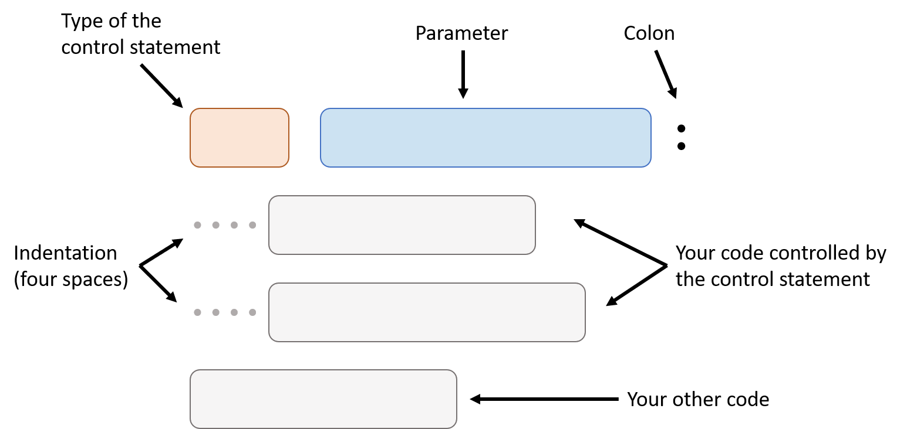
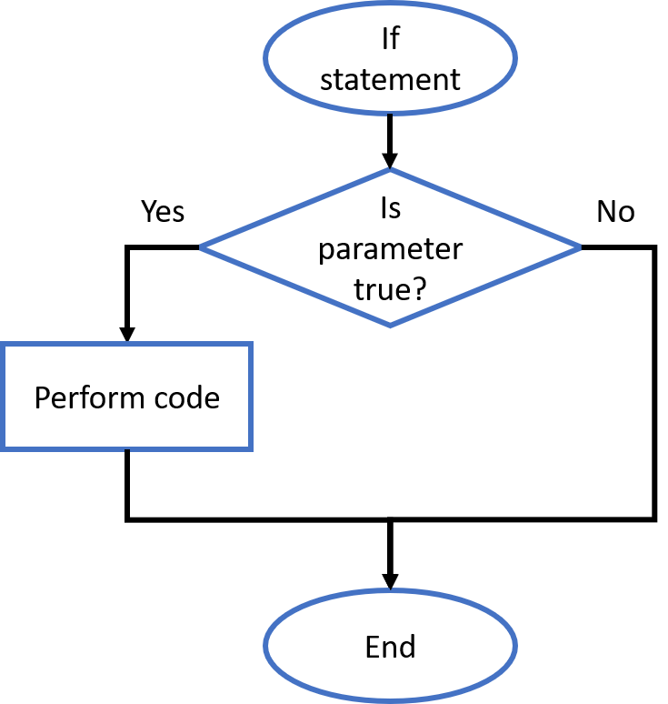
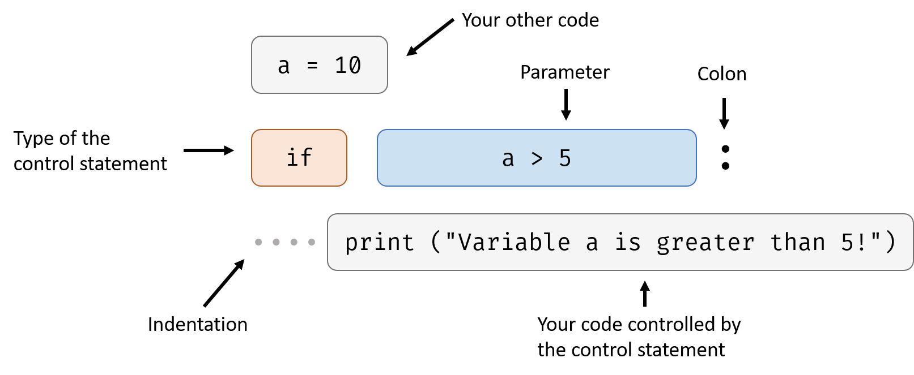
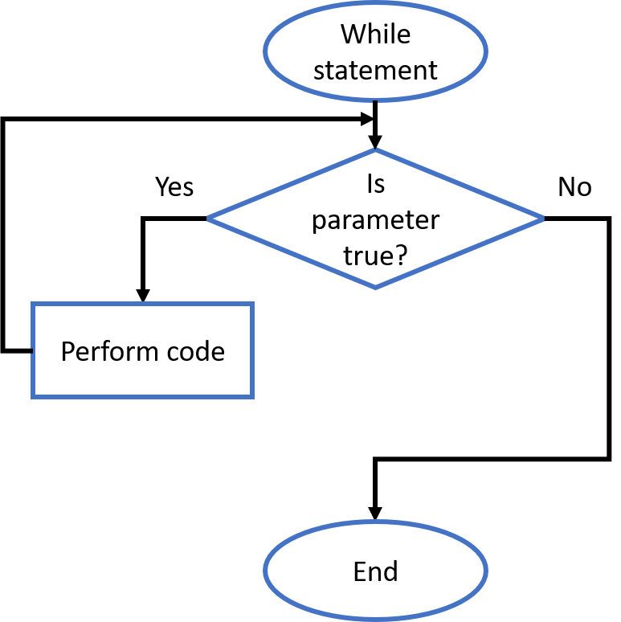
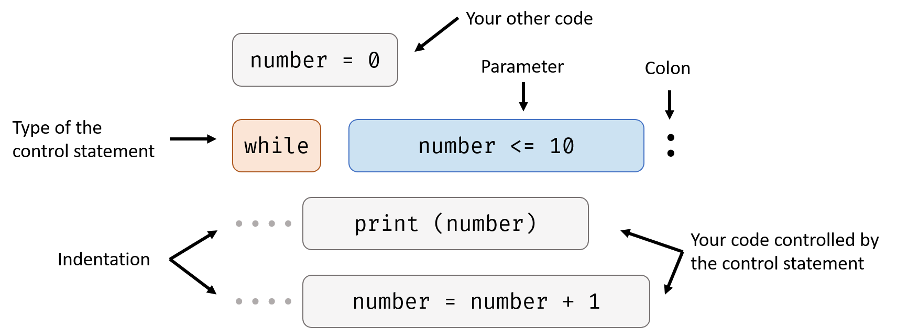
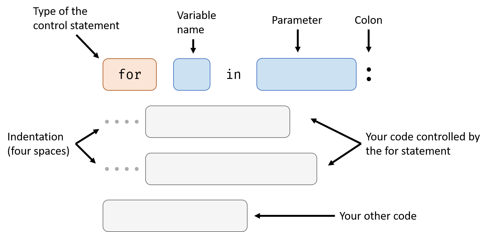
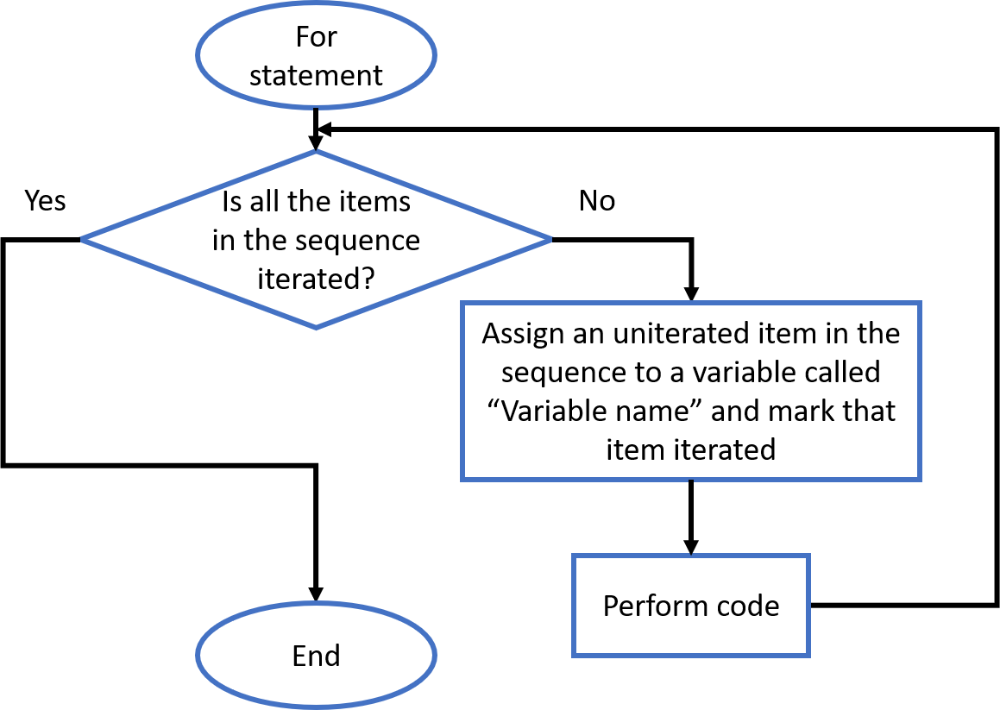
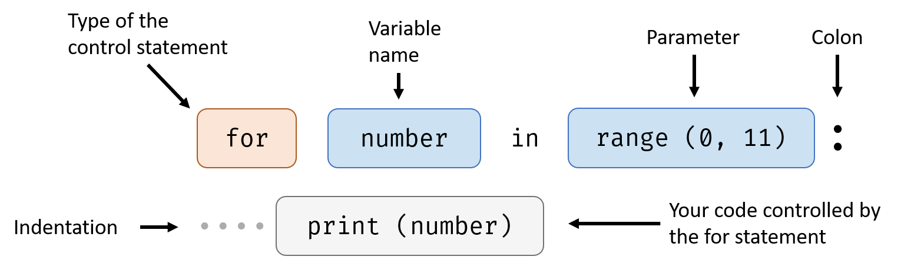

# Control Flow

## Basic Structure



### Type of the Control Statement

Some common types of control statement are if statement, while statement and for statement. We will learn how to use them in the following part of the handout.

### Parameter

Parameter tells control statement what to do. For an if statement, it's parameter tells it whether or not execute the code controlled by it.

### Indentation

Indentation is usually four spaces, it's used to tell control statement what line of code it should control. In the diagram, two indented code is controlled by the control statement, but the last line of code is not.

## If Statement

If statement needs a parameter that is Boolean type, if the parameter is true, it will perform the code in it (controlled by it).



Here is an example:

This program check if variable `a` is greater than 5. If yes, show `Variable a is greater than 5!` in the shell, if not, do nothing.

```python
a = 10
if a > 5:
    print ("Variable a is greater than 5!")
```



In this case, parameter `a > 5` is true so the code in the if statement is performed. Try change the first line `a = 10` to `a = 3`, what will happen?

## While Statement

While statement needs a parameter that is Boolean type, it performs code in it again and again until the parameter is false.



Here's an example:

This program prints all the integers from 0 to 10.

```python
number = 0
while number <= 10:
    print (number)
    number = number + 1
```



In this case, `number <= 10` is the parameter. When the first time while statement check the parameter, the result was true (because `number` was 0 when the program starts, and 0 is less than 10), so while statement performs the two lines of code in it. The first line of code `print (number)` outputs the value of the number, the second line of code `number = number + 1` increases `number` by 1.

After while statement performs the code in it, it checks the parameter again. Now `number` is 1, but still less than 10. So while statement performs code in it again.

After several rounds, the value of `number` reaches 11. At this time, the parameter of while statement is false. So it stop performing the code in it and program ends.

## For Statement

For statement follows a slightly different structure:



For statement is used for iterating over a sequence, so its parameter needs to be a sequence. An example of sequence is String, it's “a sequence of characters”.



Before we start our example, we need to know `range` function:

- Usage: get a sequence of integer

- Signature: `range (start, end)`

- Parameters:

  | Name  | Meaning                                             |
  | ----- | --------------------------------------------------- |
  | start | start number of the sequence                        |
  | end   | end number of the sequence (doesn't include itself) |

- Return value: `range` type, a sequence of integer from `start` to `end - 1`

Here's the example:

This program prints all the integers from 0 to 10.

```python
for number in range (0, 11):
    print (number)
```



In this case, `range` function gives for statement a sequence of integers (from 0 to 10), for statement assign one of them one time to `number`, then performs the code in it: print the number.

---

Another example:

This program prints all the characters in the word "hello" one by one.

```python
for character in "hello":
    print (character)
```

`"hello"` is a value, it's type is String. String is a sequence of characters so it can be used in for statement.

## Example Code

```python
if (30-10)/2**2 == 5:
    print ("Yes!")
```

> Yes!

---

```python
age = 16
if age > 15:
    print ("You are not a kid!")
if age <= 15:
    print ("You are a kid!")

age = 10
if age > 15:
    print ("You are not a kid!")
if age <= 15:
    print ("You are a kid!")
```

> You are not a kid!<br>You are a kid!

---

```python
age = 16
print ("Your age is " + str(age) + ".")
if age > 15 and age < 18:
    print ("You are not a kid or an adult!")

if age > 15:
    if age < 18:
        print ("age is greater than 15 and less than 18!")
```

> Your age is 16.<br>You are not a kid or an adult!<br>age is greater than 15 and less than 18!

---

```python
a = 0
while a <= 1:
    print (a)
    a = a + 0.1
```

> 0.0<br>0.1<br>0.2<br>0.30000000000000004<br>0.4<br>0.5<br>0.6<br>0.7<br>0.7999999999999999<br>0.8999999999999999<br>0.9999999999999999

(Like I said in *Operators* handout, the result of the math operation with decimal number is not always 100% accurate, but it's close enough.)

---

```python
a = 0
while a <= 100:
    if a-10 > 85:
        print (a)
    a = a + 1
```

> 96<br>97<br>98<br>99<br>100

---

```python
for i in range(5,10):
    print (2**i)
```

> 32<br>64<br>128<br>256<br>512

---

```python
a = 0
b = 1
n = 7
while n > 0:
    newA = b
    newB = a + b
    a = newA
    b = newB
    n = n - 1
print (b)
```

> 21

---

```python
a = 0
b = 1
n = 7
while n > 0:
    newA = b
    newB = a + b
    a = newA
    b = newB
    n = n - 1
    print (b)
```

> 1<br>2<br>3<br>5<br>8<br>13<br>21

---

```python
a=0
b=1
for n in range(1,8):
    newA=b
    newB=a+b
    a=newA
    b=newB
    print (b)
```

> 1<br>2<br>3<br>5<br>8<br>13<br>21