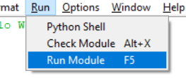

# First Line of Code

1. Open IDLE , which it’s an simple IDE (integrated development environment) for beginners.
2. After open IDLE, you will see a white window which is Python Shell (it will show our program’s out put later on). Click on File -> New File  or <kbd>Ctrl+N</kbd> to open another window which we can write code in.
3. In the new window, type `print("Hello World!")` , it should shown like this: 
4. Click Run -> Run Module  or <kbd>F5</kbd> to run your code. If it’s the first time you run, it will promote you to save it first.
5. After running your program, you should see something like this in Python Shell:

6. Congratulations! Your now know the work flow of creating a Python program and how to run it!