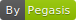

# Introduction to Programming Languages and Python

##  What is a Programming Language

> A programming language is a vocabulary and set of grammatical rules for instructing a computer or computing device to perform specific tasks.

Programming languages are languages of computers.

## Common Programming Languages

|        | Highlights                            | Most used in real world                               |
| ------ | ------------------------------------- | ----------------------------------------------------- |
| C/C++  | Complex syntax, high performance      | Operating Systems, Applications need high performance |
| Java   | Verbose code, write once run anywhere | Android development, Web Servers                      |
| Python | Easy to use, poor performance         | Web Development, Scientific Applications              |

## Python

Not a snake, but a programming language.

Python was fist announced in 1990 and keep growing because of its readability and easy to use. Now it is the third most popular language.

Above are pictures of main developers of four popular programming languages. What do you find?

*Next: [First Line of Code](First Line of Code.html)*

