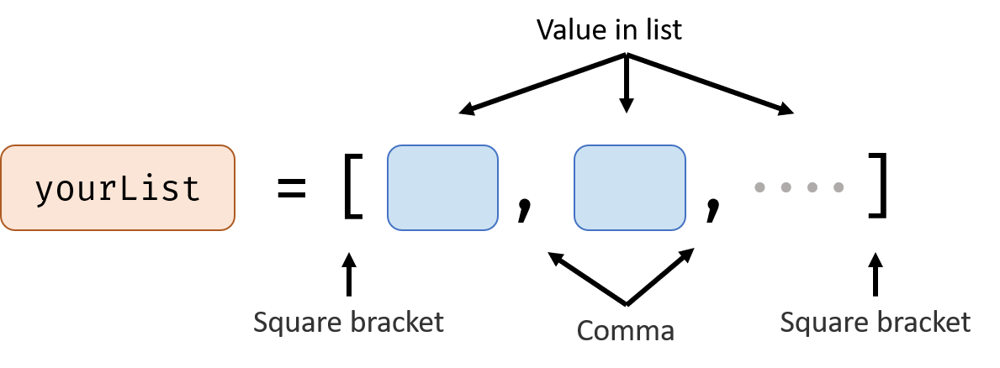
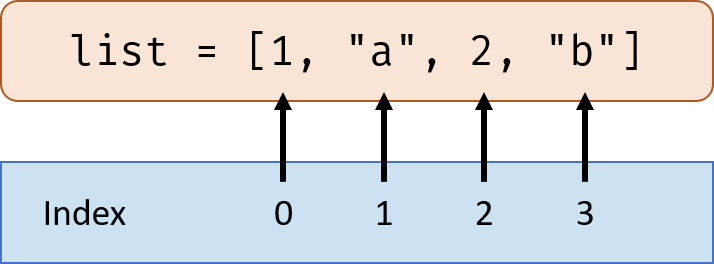
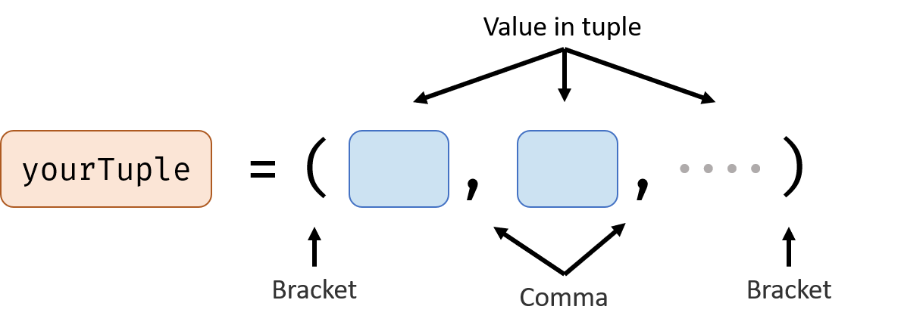

# Lists

List is a type of value, a list contains many values, you can add or delete an item from the list.

## How to Represent a List

Flowing is the example of two lists, the first list is filled with numbers, the second list is filled with strings.

<iframe src="https://test.pegasis.site/python/editor.html?fileName=1560348503" width="100%" height="166px" frameborder="0" marginwidth="0" marginheight="0" allowfullscreen></iframe>

You can put values that have different types to an list, for example:

<iframe src="https://test.pegasis.site/python/editor.html?fileName=1560348644" width="100%" height="113px" frameborder="0" marginwidth="0" marginheight="0" allowfullscreen></iframe>

## Index of the List

Now we have a list, but how to get a specific value from the list? For example, how to get the second value in the list?

Use Index.

In the list `list = [1,"a",2,"b"]`, the index for `1` is 0, index for `"a"` is 1, index increases after each item in the list. Note: Remember the index for the first item in the list is 0, not 1.

We can get a value from a list using index like this:

<iframe src="https://test.pegasis.site/python/editor.html?fileName=1560349589" width="100%" height="113px" frameborder="0" marginwidth="0" marginheight="0" allowfullscreen></iframe>

`list[1]` means the item in the list which have an index of 1. The `1` in the square bracket represents the index.

---

We can also get a part from the list like this:

<iframe src="https://test.pegasis.site/python/editor.html?fileName=1560349959" width="100%" height="113px" frameborder="0" marginwidth="0" marginheight="0" allowfullscreen></iframe>

`list[3:6]` means get the part of the list starting from index 3 to index 6. The number before colon is the starting index, the number after colon is the ending index.

## Add, Update and Remove Items from the List

### Add

If you want to add one value to the end of the list, use `list.append(item)`

If you want to insert a value to the middle of the list, use `list.insert(index, item)`

Example:

<iframe src="https://test.pegasis.site/python/editor.html?fileName=1560350621" width="100%" height="219px" frameborder="0" marginwidth="0" marginheight="0" allowfullscreen></iframe>

### Update

If you want to change the value of one item in the list, use `list[index] = newValue`

Example:

<iframe src="https://test.pegasis.site/python/editor.html?fileName=1560350823" width="100%" height="166px" frameborder="0" marginwidth="0" marginheight="0" allowfullscreen></iframe>

### Remove

If you know the index and want to remove it from the list, use `list.pop(index)`

If you know the value and want to remove it from the list, use `list.remove(value)`

Example:

<iframe src="https://test.pegasis.site/python/editor.html?fileName=1560351035" width="100%" height="219px" frameborder="0" marginwidth="0" marginheight="0" allowfullscreen></iframe>

## Get Information About the List

Length of the list: `len(list)`

If the list is all number or all string, you can use `max(list)` and `min(list)` to get the max and min value in the list.

Example:

<iframe src="https://test.pegasis.site/python/editor.html?fileName=1560351580" width="100%" height="201px" frameborder="0" marginwidth="0" marginheight="0" allowfullscreen></iframe>

## List Operators

Yes, you can add 2 lists XD

| Operator | Example         | Meaning                          | Result Value Type |
| -------- | --------------- | -------------------------------- | ----------------- |
| +        | `list1 + list2` | append list2 to the end of list1 | list              |
| *        | `list * a`      | repeat a list for a times        | list              |
| in       | `a in list`     | If value a is in the list        | boolean           |

# Tuple

A tuple is almost same as a list, except you can't change the value of it after you define it.

## How to Represent a Tuple

For example:

<iframe src="https://test.pegasis.site/python/editor.html?fileName=1560353465" width="100%" height="166px" frameborder="0" marginwidth="0" marginheight="0" allowfullscreen></iframe>

## Aspects That Different From List

Because of tuple is not changeable after defining it, so you can't add or update or remove an item from the tuple.

## Aspects that same as List

You can get value from a tuple, get length, max value and min value from a tuple.

Because operator doesn't change the item in a tuple, so you can use operators with tuple.

*Next: Advanced Function*