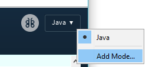
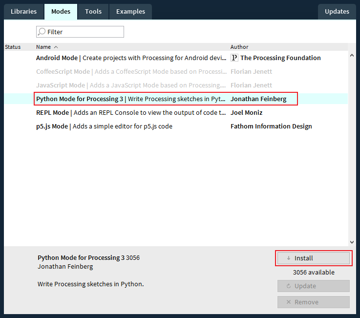
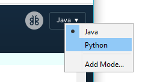
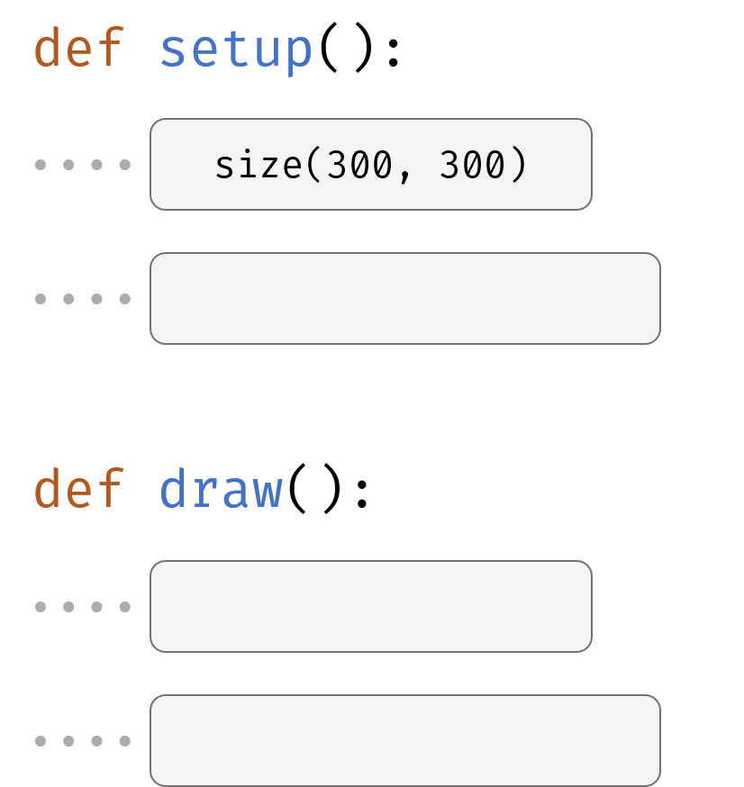

# Use Processing.py to Build GUI Applications

If you learned processing before, you will find this is really easy. Just use python instead of java to write code. If you don't know processing, don't worry, it won't be very hard.

## Install Python Mode to Processing

1. Click the Drop-down menu at the right top corner of the processing window,  then click "Add Mode".
2. Choose "Python Mode for Processing 3" in the pop-up window and click "Install".
3. Wait a few seconds for it to install, then close the pop-up window.
4. Click the drop-down menu again, then choose "Python".
5. You are now in Python Mode!

## Structure of a Processing.py Application

You need to define two functions in order to let processing.py run. The first is `setup` function, this function will invoke by processing when your application launches. It will only execute once. You need to put `size(width, height)` function in this function to set the width and height of the window.

The second function you need to define is `draw` function. This function will invoke by processing 60 times per second to create images on the screen.

For more tutorials for Processing.py, you can move to <https://py.processing.org/tutorials/>.

