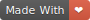
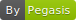

# Python Handouts  

 This work is licensed under a <a rel="license" href="http://creativecommons.org/licenses/by-sa/4.0/">Creative Commons Attribution-ShareAlike 4.0 International License</a>.

Last update: June 16, 2019

Handouts are in following sequence:

1. [Introduction to Programming Languages and Python](Introduction to Programming Languages and Python.html)
2. [First Line of Code](First Line of Code.html)
3. [Basic Terms](Basic Terms.html)
4. [Values](Values.html)
5. [Variables](Variables.html)
6. [Operators](Operators.html)
7. [Basic Function](Basic Function.html)
8. [Control Flow](Control Flow.html)
9. [More About If Statement](More About If Statement.html)
10. [Code Readability](Code Readability.html)
11. [Lists and Tuples](Lists and Tuples.html)
12. [Advanced Function](Advanced Function.html)
13. [Import Statement](Import Statement.html)
14. [Object-Oriented Programming](Object-Oriented Programming.html)
15. [How to Use a Class](How to Use a Class.html)
16. [How to Create a Class](How to Create a Class.html)
17. [Use Processing.py to Build GUI Applications](Use Processing.py to Build GUI Applications.html)

## Road Map

Now I’m working on handouts, which includes all the thing I’m going to teach you. After finishing handouts, I’ll work on practice problems and slides.

